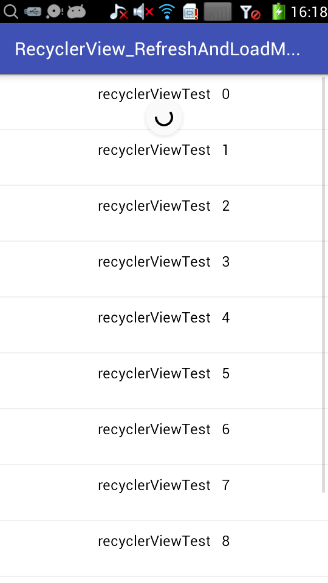
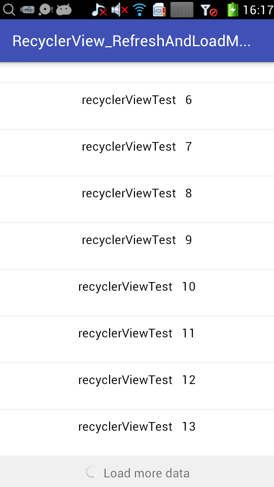

# RecyclerView_RefreshAndLoadMore
基于RecyclerView的下拉刷新和上拉加载的简单实现，详细说明参见【Android实战】----RecyclerView下拉刷新和上拉加载的简单实现 http://blog.csdn.net/honghailiang888/article/details/62038557

1）基于SwipeRefreshLayout的下拉刷新：

2）基于RecyclerView的addOnScrollListener的上拉加载更多：

o
